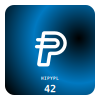

# Writing, testing, and deploying an onchain-rendered NFT smart contract that accepts PYUSD

This guide is a quick introduction to smart contract development with PYUSD. We will use the Foundry development toolkit.

## Introduction

PYUSD is PayPal's stablecoin, implemented on Ethereum as a smart contract that implements the ERC-20 standard. As an ERC-20, both external applications and other smart contracts can integrate with PYUSD just like any other ERC-20 token.

Foundry is a powerful tool for smart contract development. It provides a robust and flexible framework for building, testing, and deploying smart contracts.

In this guide we are going to write a simple smart contract that accepts PYUSD as fee to mint an NFT.

### Assumptions

We're going to assume a few starting points:

- We have `git` set up locally
- We're running on a Linux flavor or a Mac
- We are comfortable with some command line stuff
- We like tests and test coverage!

We won't assume:

- Any knowledge of Ethereum, Solidity, or Solidity tooling

## Setup

### Alchemy RPC Endpoint (or similar)

We'll need an Ethereum RPC endpoint for the Sepolia test network. You can sign up for an account and create a unique RPC endpoint using one of the popular services. Suggestions:

- [Alchemy](https://www.alchemy.com/) (recommended)
- [Infura](https://www.infura.io/)
- [Ankr](https://www.ankr.com/)

### Etherscan API Key

We'll also need to Etherscan to grab [an API key](https://etherscan.io/myapikey), which we can use to verify our contract's source code when we deploy. [Free sign up](https://etherscan.io/register) if you don't have an account.

### Foundry

If you have not yet installed Foundry, go ahead and follow its [Getting Started docs](https://book.getfoundry.sh/getting-started/installation). Once installed, you can initialize a new project using the `forge init` command:

```bash
$ forge init hello-pyusd-erc721
```

Now let's step into our fresh `hello-pyusd-erc721` project. It is already set up a local git repository, and is configured for immediate usage. Here are the files you'll find:

```bash
$ cd hello-pyusd-erc721
$ tree . -d -L 1
.
├── lib
├── script
├── src
└── test

5 directories
```

Once initialized, you can run a few commands to see how building and testing works. To build:

```bash
forge build
```

And to test (which includes a build):

```bash
forge test
```

If you'd like to rebuild and run tests whenever a file changes, you can use the `-w` flag, and maybe throw in a `-vv` for extra output:

```bash
forge test -vvw
```

You'll notice a test suite is passing already! That's because example files are already present:

- `src/Counter.sol`
- `test/Counter.t.sol`
- `script/Counter.s.sol`

You can keep these around for now. We won't be using them, but they won't affect our project.

### VS Code

We're going to assume you're using VS Code for this project, since it's one of the most common editors as of 2024. If you are using a different editor, please refer to the any relevant packages or documentation to get your editor correctly highlighting, formatting, or linting solidity.

Our VS Code setup:

#### Install a solidity extension

One of the popular Solidity extensions is the ['solidity' extension by Juan Blanco](https://marketplace.visualstudio.com/items?itemName=JuanBlanco.solidity).

#### Configure

In your User Settings JSON, go ahead and add the following configuration:

```json
{
  "solidity.monoRepoSupport": false,
  "solidity.packageDefaultDependenciesContractsDirectory": "src",
  "solidity.packageDefaultDependenciesDirectory": "lib",
  "solidity.compileUsingRemoteVersion": "v0.8.23",
  "solidity.formatter": "forge",
  "[solidity]": {
    "editor.tabSize": 4,
    "editor.defaultFormatter": "JuanBlanco.solidity"
  }
}
```

A few notes for the curious:

- We're disabling `monoRepoSupport` because it sometimes triggers unexpected import errors in the editor.
- The two `packageDefaultDependencies...` fields are configured here to Foundry's defaults.
- The `compileUsingRemoteVersion` tells the extension which version of Solidity to download and run. Let's use 0.8.23 here, though most other versions past 0.8.0 will be fine.
- We're setting `formatter` to `forge` to instruct our default formatter to actually use the `forge fmt` command.

### Get started

Once your editor and project are set up, go ahead and open your project. In VS Code it will look something like this:


Yay! We are ready to go. 🎉

## First steps with Solidity

### Create a new smart contract

Let's create a new smart contract file in our `src` directory. We'll name it `src/HelloPYUSD.sol`:

```solidity
// SPDX-License-Identifier: MIT
pragma solidity 0.8.23;

contract HelloPYUSD {}
```

We're doing a few things in this little bit of code:

1. Specifying the license of our contract (we're using MIT here, but there are plenty of others to choose from; Use `UNLICENSED` if you prefer to not specify a license)
2. Specifying the solidity version. We're using `0.8.23` above.
3. Creating a totally empty smart contract.

Let's now check if it builds:

```
forge build
```

It should! If not, make you copied the above correctly. Once it's building, let's now commit our work to git:

```bash
$ git add src/HelloPYUSD.sol
$ git commit -m "Create empty HelloPYUSD smart contract"
```

### Our first test

Let's create a simple test suite for our contract. We can generate a scaffold using Foundry:

```bash
$ forge generate test --contract-name HelloPYUSD
```

Now go ahead and add our first test. The file will look like this:

```solidity
// SPDX-License-Identifier: MIT
pragma solidity ^0.8.13;

import {Test, console} from "forge-std/Test.sol";
import {HelloPYUSD} from "../src/HelloPYUSD.sol";

contract HelloPYUSDTest is Test {
    HelloPYUSD public helloPYUSD;

    function setUp() public {
        helloPYUSD = new HelloPYUSD();
    }

    function testCreate() public {
        // Just a simple trivial test that the contract is created
        // We'll replace this later.
        assertNotEq(address(helloPYUSD), address(0));
    }
}
```

If you're not already running a watched test, go ahead and start it, and verify that our test is bassing:

```bash
$ forge test -vw
```

Finally, let's commit our little test:

```bash
git add test/HelloPYUSD.t.sol
git commit -m 'add simple test of HelloPYUSD'
```

## Turn HelloPYUSD into an NFT

You've probably heard of NFTs! Well, today we're going to write an NFT smart contract that accepts PYUSD as payment. Most NFTs on Ethereum adhere to the ERC-721 standard, meaning that the smart contract must have specific functions with specific behaviors.

Rather than implement an ERC-721 standard from scratch, smart contract developers typically leverage existing codebases. There are many ways to do this, but in our particular case we're going to inherit from an audited, minimal ERC-721 solidity implementation from the [solmate project](https://github.com/transmissions11/solmate).

We'll add this dependency via forge:

```bash
$ forge install transmissions11/solmate
```

The above uses git submodules to pull the dependency into our `lib` directory, and it commits the addition.

We can now integrate the solmate ERC721 contract into our project:

```solidity
// SPDX-License-Identifier: MIT
pragma solidity 0.8.23;

import {ERC721} from "solmate/tokens/ERC721.sol";

contract HelloPYUSD is ERC721 {
    uint256 public totalIssued;

    constructor() ERC721("HelloPYUSD", "HIPYPL") {}

    function mint() external {
        _mint(msg.sender, ++totalIssued);
    }

    function tokenURI(uint256) public pure override returns (string memory) {
        return "";
    }
}
```

In the above, we:

1. Import `ERC721` contract, which we inherit from
2. Add storage for `totalIssued` to keep track of the count/
3. Adjust our constructor to call the `ERC721` constructor to set our NFT's name to `Hello PYUSD` and its symbol to `HIPYPL`.
4. Add a `mint` function that lets the caller mint the next ID, incrementing `totalIssued`.
5. Implement the abstract `tokenURI` function to just return an empty string (for now).

Notice we are not yet accepting payment! But that's ok, we'll get there.

### Testing our mint function

Let's now go back to our tests and add some testing for the mint function. Add the following to your test suite:

```solidity
function testMint() public {
    helloPYUSD.mint();
    assertEq(helloPYUSD.balanceOf(address(this)), 1);
    assertEq(helloPYUSD.totalIssued(), 1);
}
```

We now see that the balance of the caller – `address(this)` – is `1`, and the `totalIssued()` is also `1`. Yay, so far so good!

## Accepting PYUSD

### The PYUSD contracts

PYUSD is an ERC-20 token.[^ERC20] So as protocol developers, all we need to know is its address, and we can pull it in and use it just like any other ERC-20.

[^ERC20]: Similar to the ERC-721 we're building in this walkthrough, and ERC-20 token adheres to certain interface and behaviors to define a _fungible_ token. ERC stands for "Ethereum Request for Comments" and is a process by which essential standards are defined.

Let's take note of the PYUSD addresses we'll need:

- Sepolia Testnet `0xCaC524BcA292aaade2DF8A05cC58F0a65B1B3bB9`
- Ethereum Mainnet `0x6c3ea9036406852006290770BEdFcAbA0e23A0e8`

We'll also create a mock PYUSD for local tests. Create a `test/MockPYUSD.sol` file that inherits from solmate's ERC20:

```solidity
// SPDX-License-Identifier: MIT
pragma solidity >=0.8.0;

import {ERC20} from "solmate/tokens/ERC20.sol";

contract MockERC20 is ERC20 {

    constructor() ERC20("MockPYUSD", "mockPYUSD", 6) {}

    function mint(address to, uint256 value) public virtual {
        _mint(to, value);
    }
}
```

Let's now commit our `MockPYUSD.sol` contract:

```bash
git add test/MockPYUSD.sol
git commit -m 'add MockPYUSD ERC-20 contract for local tests'
```

### TDDing the expected behavior

Unlike native ETH values which can be specified as part of a call to a function, ERC-20s require a two step process to be transferred as part of contract calls:

1. Token holder approves a spender and a maximum amount (allowance) available to be transferred by that spender.
2. Token holder makes a call in which an amount (no greater than the allowance amount) is transferred.

We'll now modify our test a bit so that our `testMint()` function checks the mint price and approves our mock PYUSD to be spent by the `mint()` function.

```solidity
// SPDX-License-Identifier: MIT
pragma solidity ^0.8.13;

import {Test, console} from "forge-std/Test.sol";
import {HelloPYUSD} from "../src/HelloPYUSD.sol";
import {MockPYUSD} from "./MockPYUSD.sol";

contract HelloPYUSDTest is Test {
    MockPYUSD public pyusd;
    HelloPYUSD public helloPYUSD;

    uint256 constant MINT_PRICE = 100e6;

    function setUp() public {
        pyusd = new MockPYUSD();
        helloPYUSD = new HelloPYUSD(address(pyusd), MINT_PRICE);
    }

    function testCreate() public {
        assertNotEq(address(helloPYUSD), address(0));
    }

    function testMint() public {
        pyusd.mint(address(this), MINT_PRICE);
        pyusd.approve(address(helloPYUSD), MINT_PRICE);

        helloPYUSD.mint();

        assertEq(pyusd.balanceOf(address(this)), 0);
        assertEq(pyusd.balanceOf(address(helloPYUSD)), MINT_PRICE);

        assertEq(helloPYUSD.balanceOf(address(this)), 1);
        assertEq(helloPYUSD.totalIssued(), 1);
    }
}
```

We're doing a few things here, and it's a bit too much to step though everything, but note that in our `setUp()` we're creating a `MockPYUSD` contract, and we're using its address to construct our `HelloPYUSD` contract, along with a new `MINT_PRICE`.

If we're running our tests – `forge test -vw` is pretty handy, right? – this change will break our build with a compile error. We're trying to call a non-existent `mintPrice()` function! So let's go fix up our contract:

```solidity
// SPDX-License-Identifier: MIT
pragma solidity 0.8.23;

import {ERC721} from "solmate/tokens/ERC721.sol";
import {ERC20} from "solmate/tokens/ERC20.sol";

contract HelloPYUSD is ERC721 {
    uint256 public totalIssued;

    ERC20 public immutable mintToken;
    uint256 public immutable mintPrice;

    constructor(address _mintToken, uint256 _mintPrice) ERC721("HelloPYUSD", "HIPYPL") {
        mintToken = ERC20(_mintToken);
        mintPrice = _mintPrice;
    }

    function mint() external {
        mintToken.transferFrom(msg.sender, address(this), mintPrice);
        _mint(msg.sender, ++totalIssued);
    }

    function tokenURI(uint256) public pure override returns (string memory) {
        return "";
    }
}
```

Now our tests are passing again. Lovely!

The behavior of the ERC-20 token depends on how it is implemented. Correctly implemented ERC-20s will now allow insufficient balances to be spent, nor will allow spenders to go over their allowance.

While it's outside the purview of our own contract (and is the responsibility of PYUSD, which of course does everything correctly), if you want to see these error cases in action, you can add some failure tests:

```solidity
function testFail_MintWithoutApproval() public {
    helloPYUSD.mint();
}

function testFail_MintWithInsufficientBalance() public {
    pyusd.approve(address(helloPYUSD), MINT_PRICE);
    helloPYUSD.mint();
}
```

Let's commit our latest work here:

```bash
git commit -am 'accept ERC-20 token for mint payment'
```

### Who gets the PYUSD?

You may notice that in the contract we've created, all the PYUSD is deposited to the contract itself. Once there, it's never usable for anything, so it's essentially lost! There's currently no way for an actual human to receive it.

Let's fix thi by letting an owner withdraw ETH and ERC-20s from this contract. In our tests, let's add failing tests:

```solidity
function testOwnerWithdrawToken() public {
    pyusd.mint(address(helloPYUSD), MINT_PRICE);
    helloPYUSD.withdrawToken(address(pyusd), address(this));
    assertEq(pyusd.balanceOf(address(this)), MINT_PRICE);
}

function testFail_nonOwnerWithdrawToken() public {
    vm.prank(address(0xabcd));
    helloPYUSD.withdrawToken(address(pyusd), address(this));
}

function testOwnerWithdraw() public {
    address recipient = address(0x1234);
    vm.deal(address(helloPYUSD), 1 ether);
    helloPYUSD.withdraw(recipient);
    assertEq(recipient.balance, 1 ether);
}

function testFail_nonOwnerWithdraw() public {
    vm.prank(address(0xabcd));
    helloPYUSD.withdraw(address(this));
}
```

These will break our build, so let's go ahead and implement `withdrawToken` and `withdraw`. First, import `Owned` and `SafeTransferLib` in our contract:

```solidity
import {Owned} from "solmate/auth/Owned.sol";
import {SafeTransferLib} from "solmate/utils/SafeTransferLib.sol";
```

Now ensure we are inheriting from `Owned` and defaulting the owner to the contract deployer.

```solidity
contract HelloPYUSD is ERC721, Owned {
// ...

    constructor(address _mintToken, uint256 _mintPrice) ERC721("HelloPYUSD", "HIPYPL") Owned(msg.sender) {
        //...
    }
// ...
}
```

Finally, we'll add our withdraw functions:

```solidity
function withdrawToken(address token, address to) external onlyOwner {
    SafeTransferLib.safeTransfer(ERC20(token), to, ERC20(token).balanceOf(address(this)));
}

function withdraw(address to) external onlyOwner {
    SafeTransferLib.safeTransferETH(to, address(this).balance);
}
```

At this point, tests should be passing and we can commit:

```bash
git commit -am 'add withdraw functions'
```

### What about that empty tokenURI?

The ERC-721 `tokenURI` function is used to specify a URI that can be accessed metadata about a specific tokenId. In typical cases, these URIs are an `http` or `ipfs` protocol, but it's also fine to use a data URI and encode the entire URI _onchain_, meaning no dependencies on external resources. In this section we'll add an onchain renderer of JSON metadata and an SVG image.

If you prefer to do this the simple way, just implement like this:

```
/// add an import of LibString in your imports section
import {LibString} from "solmate/utils/LibString.sol";

/// now return a URI concatenated with your tokenId
function tokenURI(uint256) public pure override returns (string memory) {
    return string(abi.encodePacked("my-base-url-here/", LibString.toString(tokenId)));
}
```

But if you like the sound of fully onchain NFTs, read on!

#### Side Quest: Rendering JSON and SVG onchain

##### Get a Base64 library

Add the `vectorized/solady` dependency, which has a few libraries we'll need:

```bash
forge install vectorized/solady
```

##### Create a Renderer library

We need to render a data URI JSON string, which in turn includes a field that is SVG, which we'll also encode as a data URI. To do this, we'll use the Base64 lib from solady, and we'll write a bunch of gnarly json and svg generation code.

```solidity
// SPDX-License-Identifier: MIT
pragma solidity 0.8.23;

import {LibString} from "solady/Milady.sol";
import {Base64} from "solady/Milady.sol";

library Renderer {
    function tokenURI(uint256 tokenId) internal pure returns (string memory) {
        bytes memory jsonData = abi.encodePacked(
            '{"name": "HelloPYUSD #',
            LibString.toString(tokenId),
            '"',
            '"description": "HelloPYUSD is an NFT contract you can mint with PYUSD!",',
            '"image": "',
            abi.encodePacked("data:image/svg+xml;base64,", Base64.encode(svg(tokenId))),
            '"}'
        );

        return string(abi.encodePacked("data:application/json;base64,", Base64.encode(jsonData)));
    }

    function svg(uint256 tokenId) internal pure returns (bytes memory) {
        return abi.encodePacked(
            "<svg xmlns='http://www.w3.org/2000/svg' viewBox='-50 -50 100 100'>",
            defs(tokenId),
            styles(),
            "<g id='container' fill='",
            tokenId % 2 == 0 ? "white" : "black",
            "'>",
            "<g class='rotation rotateZ'>",
            "<g class='rotation rotateY'>",
            "<g id='cardBody'>",
            "<rect class='bg' width='100%' height='100%' rx='10' ry='10' />",
            "<svg width='100%' height='66%' y='16%' viewBox='0 0 48 48' >",
            "<path d='M27.8122 9.60547H25.177H19.3683C18.4332 9.60547 17.6115 10.2855 17.4698 11.2206L16.8748 15.0458V15.0742H14.0412C13.2762 15.0742 12.6811 15.6976 12.6811 16.4343C12.6811 17.1993 13.3045 17.7944 14.0412 17.8227H16.4497L16.0247 20.4579L15.9964 20.6562H13.1628C12.3978 20.6562 11.8027 21.2796 11.8027 22.0163C11.8027 22.753 12.4261 23.3764 13.1628 23.3764H15.5713L14.2679 31.622L13.8429 34.3705L13.6162 35.844C13.4462 37.0057 14.3246 38.0541 15.5147 38.0541H17.3281H19.8216H21.8618C22.7968 38.0541 23.5902 37.3741 23.7602 36.439L24.9787 28.8735H25.687H27.9539C33.3092 28.8735 37.6729 24.4532 37.5879 19.0695C37.5029 13.7708 33.0825 9.60547 27.8122 9.60547ZM19.2266 17.8227L27.7838 17.851C28.5489 17.851 29.2006 18.4744 29.2006 19.2678C29.2006 20.0329 28.5772 20.6846 27.7838 20.6846H18.7732L19.2266 17.8227ZM27.8405 26.0966H26.3954H25.7154H24.2703C23.3352 26.0966 22.5418 26.7767 22.3718 27.7117L21.1534 35.3056H16.5064L18.3482 23.4048H27.7838C30.079 23.4048 31.9208 21.5346 31.9208 19.2678C31.9208 17.001 30.0507 15.1309 27.7838 15.1309L19.6799 15.1025L20.105 12.3823H27.9822C31.8358 12.3823 34.9527 15.5559 34.8677 19.4095C34.7543 23.1497 31.6091 26.0966 27.8405 26.0966Z'  />",
            "</svg>",
            "<g>",
            "<text y='83%' x='50%' class='text bold hello'>HIPYPL</text>",
            "<text y='93%' x='50%' class='text bold tokenId'>",
            LibString.toString(tokenId),
            "</text>",
            "</g></g></g></g></g></svg>"
        );
    }

    function defs(uint256 tokenId) internal pure returns (bytes memory) {
        uint256 h = uint256(keccak256(abi.encodePacked(tokenId)));
        uint256 cx = h % 100;
        uint256 cy = (h >> 8) % 100;

        return abi.encodePacked(
            "<defs>",
            "<radialGradient id='gradient' cx='",
            LibString.toString(cx),
            "%' cy='",
            LibString.toString(cy),
            "%' r='1'>",
            "<animate attributeName='r' values='1;2;1' dur='10s' repeatCount='indefinite'/>",
            gradientStop(h >> 16, 0),
            gradientStop(h >> 17, 50),
            gradientStop(h >> 18, 100),
            "</radialGradient>",
            "</defs>"
        );
    }

    function gradientStop(uint256 v, uint256 i) internal pure returns (string memory) {
        return string(abi.encodePacked("<stop offset='", LibString.toString(i), "%' stop-color='", color(v), "' />"));
    }

    function color(uint256 v) internal pure returns (string memory) {
        v = v % 8;
        if (v == 0) return "red";
        if (v == 1) return "deeppink";
        if (v == 2) return "#0079C1";
        if (v == 3) return "#00457C";
        if (v == 4) return "purple";
        if (v == 5) return "fuscia";
        if (v == 6) return "pink";
        if (v == 7) return "cyan";
    }

    function styles() internal pure returns (bytes memory) {
        return abi.encodePacked(
            "<style>",
            ".tokenId{font-family:monospace;font-size:0.4em;text-anchor:middle;alignment-baseline:middle;font-size:0.7em;font-weight:bold}",
            ".hello{font-family:monospace;text-anchor:middle;font-size:0.3em;font-weight:bold}",
            ".bg{fill:url(#gradient)}",
            "#container{transform:scale(0.9)rotateX(12deg);transform-style:preserve-3d;filter:drop-shadow(0px 0px 2px #000)}",
            ".rotation{animation-timing-function:ease-in-out;animation-iteration-count:infinite;animation-direction:alternate;}",
            ".rotateY{animation-name:rotateY;animation-duration:7.5s;}",
            "@keyframes rotateY{0%{transform:rotateY(0)}33%{transform:rotateY(-30deg)}66%{transform:rotateY(0deg)}to{transform:rotateY(30deg)}}",
            ".rotateZ{animation-name:rotateZ;animation-duration:5.5s}",
            "@keyframes rotateZ{from{transform:rotateZ(-2deg)}to{transform:rotateZ(2deg)}}",
            "#cardBody{transform:translate(-50%, -50%)}",
            "</style>"
        );
    }
}
```

##### Adjust our HelloPYUSD contract

Import our rendered:

```solidity
import {Renderer} from "./Renderer.sol";
```

And update our tokenURI function to use it:

```solidity
function tokenURI(uint256 tokenId) public pure override returns (string memory) {
    return Renderer.tokenURI(tokenId);
}
```

We now have some nice SVG renders that are different with every token. Some examples:




## Deploying

So we have our tested ERC721 contract with onchain rendering. Mints are paid for with PYUSD, and an owner can withdraw. How do we deploy? And how do we test our deploy?

There are a few ways to deploy with Foundry, but one nice way to do this is by writing a script that _broadcasts_ the transactions.

### The deploy script

Let's create a new script, `script/Deploy.s.sol` where we'll write our simple deploy logic.

```solidity
// SPDX-License-Identifier: MIT
pragma solidity ^0.8.13;

import {Script} from "forge-std/Script.sol";
import {HelloPYUSD} from "../src/HelloPYUSD.sol";

contract Deploy is Script {
    uint256 public constant MINT_PRICE = 1e6;

    function run() public {
        address pyusd = vm.envAddress("PYUSD");
        vm.broadcast();
        new HelloPYUSD(pyusd, MINT_PRICE);
    }
}
```

We can try this out as a dry-run like this:

```bash
 PYUSD=0xCaC524BcA292aaade2DF8A05cC58F0a65B1B3bB9 forge script script/Deploy.s.sol
```

### Configure

In order to run this against a real network, we'll need to specify some more config. Let's fill in some our `SEPOLIA_RPC_URL` and `ETHERSCAN_API_KEY` values in a `.env` file:

```
MAINNET_RPC_URL=
SEPOLIA_RPC_URL=
ETHERSCAN_API_KEY=
```

(you can also add a `MAINNET_RPC_URL` if you plan to deploy to mainnet)

Then let's configure our `foundry.toml` so foundry knows exactly :

```toml
[rpc_endpoints]
localhost = "http://localhost:8545/"
sepolia = "${SEPOLIA_RPC_URL}"
mainnet = "${MAINNET_RPC_URL}"

[etherscan]
sepolia = { key = "${ETHERSCAN_API_KEY}", chain = "sepolia" }
mainnet = { key = "${ETHERSCAN_API_KEY}", chain = "mainnet" }
```

### Create a wallet

We'll now create a new wallet and import it into a keystore. The `cast` command, included with Foundry, makes this pretty easy.

If you already have a hardware wallet you'd like to use, refer to the `forge script` docs.

To create a random wallet:

```bash
cast wallet new
```

To create a vanity wallet starting with some prefix:

```bash
cast wallet vanity --starts-with 2222
```

In either case, the private key will be printed out alongside the public key address. This isn't ideal from a security perspective but it's fine for deploying our little contract on a testnet (if we end up using this code on mainnet, it would be a good idea to transfer ownership of the contract once deployed).

Write that private key down, clear your terminal, then invoke the following

```bash
mkdir -p keystore
cast wallet import deployer --interactive --keystore-dir keystore
```

You'll be prompted to enter your private key and a password to encrypt the key. Once you've entered both, the command will print out some info:

```
`deployer` keystore was saved successfully. Address: 0x222256573674aefe5A38eB358e076aE90E3Be9Ea
```

### Fund the wallet

Now that we have a wallet address, we can acquire Sepolia ETH from a friend or [a faucet](https://www.alchemy.com/faucets/ethereum-sepolia) to pay for the deployment gas.

Once funded, you can check your balance with cast:

```bash
cast balance 0x222256573674aefe5A38eB358e076aE90E3Be9Ea --rpc-url sepolia
```

(use your own deployer address)

### Deploy

We have a funded wallet, a script, and a contract. Let's deploy.

```bash
PYUSD=0xCaC524BcA292aaade2DF8A05cC58F0a65B1B3bB9 \
forge script script/Deploy.s.sol \
  --keystore ./keystore/deployer \
  --rpc-url sepolia \
  --verify \
  --broadcast
```

Check out the verified contract on Sepolia Etherscan:


## Testing it all out

Since we don't have a UI yet, a simple way to test out our contract is to mint via the command line via cast. Let's do it.

### Get Sepolia PYUSD

First, we'll get some Sepolia PYUSD for our deployer. Visit the [Sepolia PYUSD Faucet](https://faucet.paxos.com) and enter your deployer address:


Once that has confirmed, check your balance:

```bash
cast call --rpc-url sepolia 0xCaC524BcA292aaade2DF8A05cC58F0a65B1B3bB9 "balanceOf(address)" 0x222256573674aefe5A38eB358e076aE90E3Be9Ea | cast to-dec
```

(use your own deployer address instead of the 0x2222 address above)

We should see a result of `100000000`, which is 100 PYUSD (with six decimal places).

### Check the mint price

Remember the mint price we set? Let's go retrieve it from our contract:

```bash
cast call --rpc-url sepolia 0x4F3Fcba5af502c8c5A4274FA71e9d07eB0bdf099 "mintPrice()" | cast to-dec
```

(use your own contract address here, or you can use the above deployed one)

We get back a result of `1000000`, which is 1 PYUSD. So far so good!

### Approve HelloPYUSD to spend some PYUSD

Let's now tell PYUSD that it is OK if our contract spends our PYUSD:

```bash
cast send \
  --keystore keystore/deployer \
  --rpc-url sepolia 0xCaC524BcA292aaade2DF8A05cC58F0a65B1B3bB9 \
  "approve(address,uint256)" \
  0x4F3Fcba5af502c8c5A4274FA71e9d07eB0bdf099 \
  1000000
```

### Mint!

Let's now tell PYUSD that it is OK if our contract spends our PYUSD:

```bash
cast send \
  --keystore keystore/deployer \
  --rpc-url sepolia 0x4F3Fcba5af502c8c5A4274FA71e9d07eB0bdf099 \
  "mint()"
```
