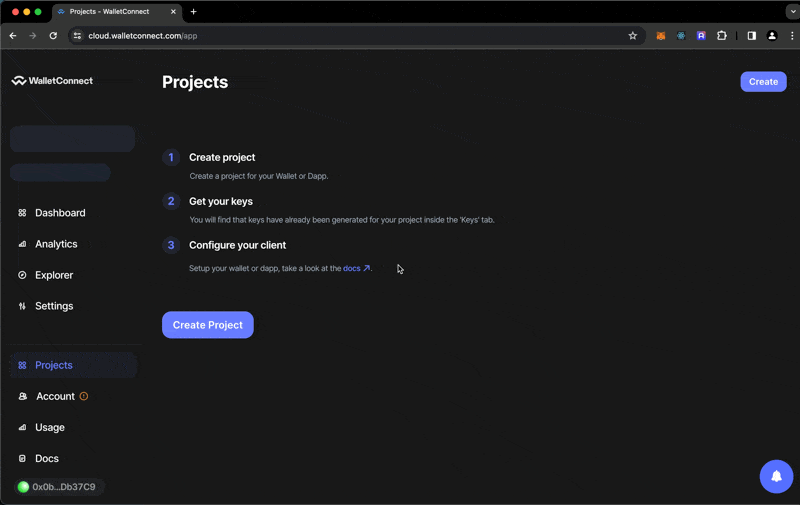
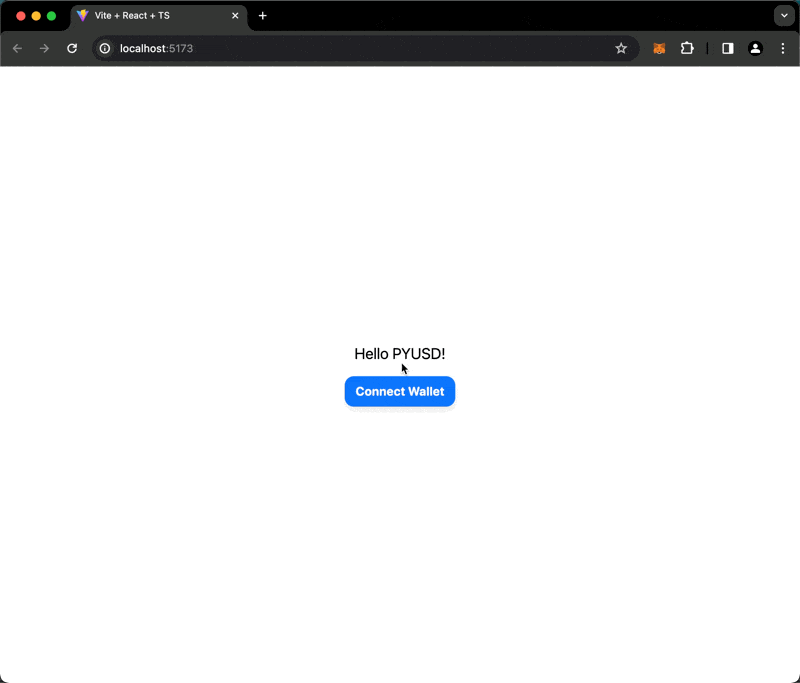

# Set up our Web3 stack

We're now ready to turn our web2 frontend into a web3 app!

We'll use a popular Web3 connection library called [RainbowKit](https://www.rainbowkit.com/) to connect to the user's wallet. RainbowKit is straightforward to integrate and supports almost all major wallets.[^connect-libs]

[^connect-libs]: Some similar modern options are [Web3Modal](https://web3modal.com/), [Family ConnectKit](https://docs.family.co/connectkit).

Following [RainbowKit's guide](https://www.rainbowkit.com/docs/installation), we'll install the package and set up the connection.

```shell
npm install @rainbow-me/rainbowkit wagmi viem@2.x @tanstack/react-query
```

Since `src/App.tsx` is our main entrypoint, let's add our imports and config there. We'll also import the `HelloPyusd` component we created earlier:

```tsx
import "@rainbow-me/rainbowkit/styles.css";

import { getDefaultConfig, RainbowKitProvider } from "@rainbow-me/rainbowkit";
import { WagmiProvider } from "wagmi";
import { mainnet, sepolia, localhost } from "wagmi/chains";
import { QueryClientProvider, QueryClient } from "@tanstack/react-query";
import HelloPyusd from "./components/HelloPyusd";
```

The above imports bring in the RainbowKit styles, the chains we'll support, and a number of Provider compnents we'll wrap our app in.

Now let's configure RainbowKit. We'll use the `getDefaultConfig` function to specify how our app works with the WalletConnect modal, as well as the chains it supports.

```tsx
const config = getDefaultConfig({
  appName: "Hello PYUSD",
  projectId: import.meta.env.VITE_WALLETCONNECT_PROJECT_ID,
  chains: [mainnet, sepolia, localhost],
});
```

We'll also set up a `QueryClient` instance that will be used by Tanstack Query, a state management library we'll use to manage our request/response state.

```tsx
const queryClient = new QueryClient();
```

Now we can wrap our app in the RainbowKit, Wagmi, and QueryClient providers:

```tsx
export default function App() {
  return (
    <WagmiProvider config={config}>
      <QueryClientProvider client={queryClient}>
        <RainbowKitProvider>
          <HelloPyusd />
        </RainbowKitProvider>
      </QueryClientProvider>
    </WagmiProvider>
  );
}
```

And let's edit our `HelloPyusd` component to show a button for connecting/disconnecting:

```tsx
import { ConnectButton } from "@rainbow-me/rainbowkit";

export default function HelloPyusd() {
  return (
    <div className='flex flex-col gap-4 items-center justify-center min-h-screen'>
      <h1 className='text-xl'>Hello PYUSD!</h1>
      <ConnectButton />
    </div>
  );
}
```

We'll notice in our browser console that we're getting a `No projectId found` error. Let's fix this now.

## WalletConnect Project ID

See that weird `VITE_WALLETCONNECT_PROJECT_ID` variable above? That's pulled in as an environment variable, and it is a WalletConnect Project ID necessary to use Rainbow in its default configuration. We can get our Project ID by signing up at [WalletConnect Cloud](https://cloud.walletconnect.com) and creating a new project. You can leave it in "draft" mode for the purposes of this walkthrough:



Once we have our Project ID, let's creat a `.env` file in the root of our project and add it there:

```
VITE_WALLETCONNECT_PROJECT_ID=your-project-id
```

And let's add it to our `.gitignore` file:

```shell
// .gitignore
.env
```

Here's what we have now:



Let's commit our changes:

```shell
git add .
git commit -m "Add RainbowKit, set up WalletConnect, add ConnectButton"
```
