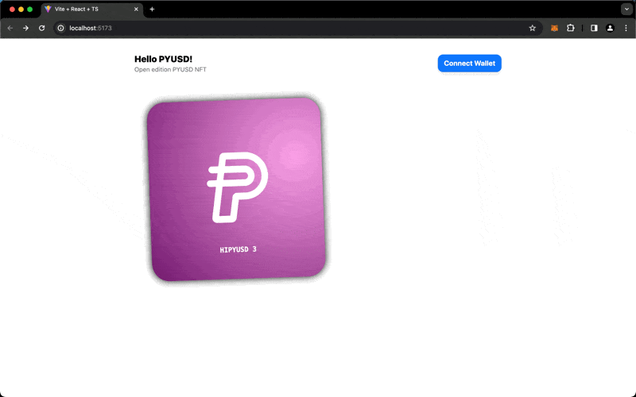

# Previewing the Mint

Let's start with our `MintPreview` component. This will show a preview of the NFT the user will mint.

## MintPreview component

We'll create a new file, `src/components/MintPreview.tsx`. We'll build this as a relatively simple `<div>` that is square and displays the image of the next token to be minted.

```tsx
import { useTotalIssued } from "../hooks/helloPyusd";
import TokenImage from "./TokenImage";

export default function MintPreview() {
  const { data: totalIssued, error } = useTotalIssued();

  if (error) {
    return <div>Error: {error.message}</div>;
  }

  return (
    <div className='text-sm text-gray-500 h-auto aspect-square flex flex-row items-center justify-center'>
      {totalIssued !== undefined ? (
        <TokenImage tokenId={totalIssued + 1n} />
      ) : (
        <div>Loading Token ID...</div>
      )}
    </div>
  );
}
```

You'll notice we are:

- Importing the `useTotalIssued` hook from `helloPyusd.ts`.
- Using the `useTotalIssued` hook to get the total number of tokens minted.
- Displaying the token image of the next token to be minted.

## TokenImage component

We'll create that `TokenImage` to handle the image display:

<<< @/../frontend/src/components/TokenImage.tsx

Here we are:

- Using our `useMetadata` hook to get the metadata for the token.
- Using the metadata to display the image of the token.

## How it should look

You should now see a preview of the token you're about to mint in your app!


