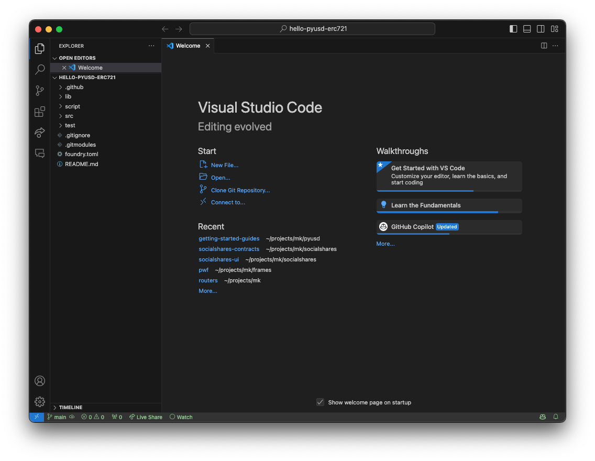

# Setup

There are a few key bits of setup we need to do before we can get started.

## RPC Endpoint (Alchemy or similar)

We'll need an Ethereum RPC endpoint for the Sepolia test network. You can sign up for an account and create a unique RPC endpoint using one of the popular services. Suggestions:

- [Alchemy](https://www.alchemy.com/) (recommended)
- [Infura](https://www.infura.io/)
- [Ankr](https://www.ankr.com/)

## Etherscan API Key

We'll also need to Etherscan to grab [an API key](https://etherscan.io/myapikey), which we can use to verify our contract's source code when we deploy. [Free sign up](https://etherscan.io/register) if you don't have an account.

## Foundry

If you have not yet installed Foundry, go ahead and follow its [Getting Started docs](https://book.getfoundry.sh/getting-started/installation). Once installed, you can initialize a new project using the `forge init` command:

```shell
$ forge init hello-pyusd-erc721
```

Now let's step into our fresh `hello-pyusd-erc721` project. It is already set up a local git repository, and is configured for immediate usage. Here are the files you'll find:

```shell
$ cd hello-pyusd-erc721
$ tree . -d -L 1
.
├── lib
├── script
├── src
└── test

5 directories
```

Once initialized, you can run a few commands to see how building and testing works. To build:

```shell
forge build
```

And to test (which includes a build):

```shell
forge test
```

If you'd like to rebuild and run tests whenever a file changes, you can use the `-w` flag, and maybe throw in a `-vv` for extra output:

```shell
forge test -vvw
```

You'll notice a test suite is passing already! That's because example files are already present:

- `src/Counter.sol`
- `test/Counter.t.sol`
- `script/Counter.s.sol`

You can keep these around for now. We won't be using them, but they won't affect our project.

## VS Code

We're going to assume you're using VS Code for this project, since it's one of the most common editors as of 2024. If you are using a different editor, please refer to the any relevant packages or documentation to get your editor correctly highlighting, formatting, or linting solidity.

Our VS Code setup:

### Install a solidity extension

One of the popular Solidity extensions is the ['solidity' extension by Juan Blanco](https://marketplace.visualstudio.com/items?itemName=JuanBlanco.solidity).

### Configure

In your User Settings JSON, go ahead and add the following configuration:

```json
{
  "solidity.monoRepoSupport": false,
  "solidity.packageDefaultDependenciesContractsDirectory": "src",
  "solidity.packageDefaultDependenciesDirectory": "lib",
  "solidity.compileUsingRemoteVersion": "v0.8.23",
  "solidity.formatter": "forge",
  "[solidity]": {
    "editor.tabSize": 4,
    "editor.defaultFormatter": "JuanBlanco.solidity"
  }
}
```

A few notes for the curious:

- We're disabling `monoRepoSupport` because it sometimes triggers unexpected import errors in the editor.
- The two `packageDefaultDependencies...` fields are configured here to Foundry's defaults.
- The `compileUsingRemoteVersion` tells the extension which version of Solidity to download and run. Let's use 0.8.23 here, though most other versions past 0.8.0 will be fine.
- We're setting `formatter` to `forge` to instruct our default formatter to actually use the `forge fmt` command.

## Get started

Once your editor and project are set up, go ahead and open your project. In VS Code it will look something like this:



Yay! We are ready to go. 🎉
