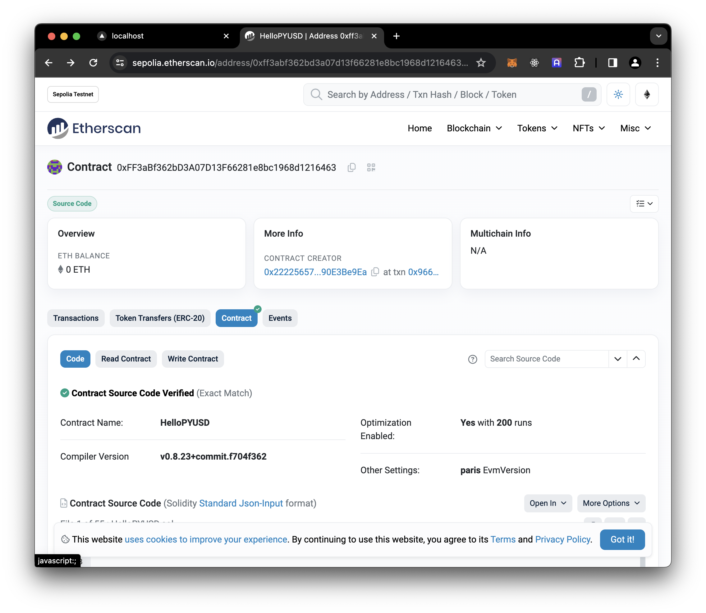

# Deploying

So we have our tested ERC721 contract with onchain rendering. Mints are paid for with PYUSD, and an owner can withdraw.

But how do we deploy?

There are a few ways to deploy with Foundry, but one nice way to do this is by writing a script that _broadcasts_ the necessary transactions to create the contract.

## The deploy script

Let's create a new script, `script/Deploy.s.sol` where we'll write our simple deploy logic.

```solidity{11-13}
// SPDX-License-Identifier: MIT
pragma solidity ^0.8.13;

import {Script} from "forge-std/Script.sol";
import {HelloPYUSD} from "../src/HelloPYUSD.sol";

contract Deploy is Script {
    uint256 public constant MINT_PRICE = 1e6;

    function run() public {
        address pyusd = vm.envAddress("PYUSD");
        vm.broadcast();
        new HelloPYUSD(pyusd, MINT_PRICE);
    }
}
```

The key things in here are:

- We're inheriting from `Script` which gives us access to the `vm` object.
- We're defining a `run` function that will be called when the script is executed.
- We're pulling in the `PYUSD` address from the environment.
- We're broadcasting the transaction to the network.
- We're deploying a new `HelloPYUSD` contract with the `PYUSD` address and a mint price of `1e6` (one PYUSD)

We can try this out as a dry-run like this:

```shell
 PYUSD=0xCaC524BcA292aaade2DF8A05cC58F0a65B1B3bB9 forge script script/Deploy.s.sol
```

## Configure

In order to run this against a real network, we'll need to specify some more config. Let's fill in some our `SEPOLIA_RPC_URL` and `ETHERSCAN_API_KEY` values in a `.env` file:

```
SEPOLIA_RPC_URL=
ETHERSCAN_API_KEY=
```

(you can also add a `MAINNET_RPC_URL` if you plan to deploy to mainnet)

Then let's configure our `foundry.toml` so foundry knows exactly :

```toml
[rpc_endpoints]
localhost = "http://localhost:8545/"
sepolia = "${SEPOLIA_RPC_URL}"
mainnet = "${MAINNET_RPC_URL}"

[etherscan]
sepolia = { key = "${ETHERSCAN_API_KEY}", chain = "sepolia" }
mainnet = { key = "${ETHERSCAN_API_KEY}", chain = "mainnet" }
```

## Create a wallet

A contract deployment is just a certain type of transaction, and we need to pay transaction fees. We'll create cresh wallet that we can fund, and we will import it into a keystore so it will be encrypted at rest.

The `cast` command, included with Foundry, makes this pretty easy.

> [!NOTE] Bring your own wallet
> If you have a hardware wallet you'd like to use, refer to the `forge script` docs.

To create a fresh wallet:

```shell
cast wallet new
```

To create a vanity wallet starting with some prefix:

```shell
cast wallet vanity --starts-with 2222
```

In either case, the private key will be printed out alongside the public key address.

> [!CAUTION] Protect your private keys
> Generating your private key isn't ideal from a security perspective but it's fine for deploying our little contract on a testnet.
>
> If we end up using this code on mainnet, it would be a good idea to transfer ownership of the contract once deployed. Or even better, modify the contract to take an owner in the constructor.

Write that private key down somewhere safe, clear your terminal, then invoke the following

```shell
mkdir -p keystore
cast wallet import deployer --interactive --keystore-dir keystore
```

You'll be prompted to enter your private key and a password to encrypt the key. Once you've entered both, the command will print out some info:

```
`deployer` keystore was saved successfully. Address: 0x222256573674aefe5A38eB358e076aE90E3Be9Ea
```

Now your private key is encrypted in a local keystore. Keep track of that password, since you'll need to provide it wherenever we use that wallet.

## Fund the wallet

Now that we have a wallet address, we can acquire Sepolia ETH from a friend or [a faucet](https://www.alchemy.com/faucets/ethereum-sepolia) to pay for the deployment gas.

Once funded, you can check your balance with cast:

```shell
cast balance 0x222256573674aefe5A38eB358e076aE90E3Be9Ea --rpc-url sepolia
```

> [!NOTE] 👋 Use your own address!
> The `0x2222` address above is the one we used in the previous step. You should use your own deployer address.

## Deploy

We have a funded wallet on Sepolia, a script, and a contract. Let's deploy.

```shell
PYUSD=0xCaC524BcA292aaade2DF8A05cC58F0a65B1B3bB9 \
forge script script/Deploy.s.sol \
  --keystore ./keystore/deployer \
  --rpc-url sepolia \
  --verify \
  --broadcast
```

Check out the verified contract on Sepolia Etherscan:


