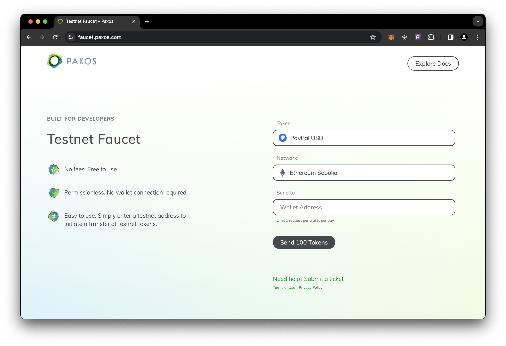

# Mint our NFT

We don't have a UI yet (see the next guide!), so a simple way to test out our contract is to mint via the command line via cast. Let's do it.

> [!TIP] Get Sepolia PYUSD
>
> We need some PYUSD on the Sepolia network. Visit the [Sepolia PYUSD Faucet](https://faucet.paxos.com):
>
> 
>
> Enter the deployer address you created in the last section.

## Check your Sepolia PYUSD balance:

```shell
cast call --rpc-url sepolia \
  0xCaC524BcA292aaade2DF8A05cC58F0a65B1B3bB9 \
  "balanceOf(address)" 0x222256573674aefe5A38eB358e076aE90E3Be9Ea \
  | cast to-dec
```

(use your own deployer address instead of the 0x2222 address above)

## Check the mint price

Remember the mint price we set? Let's go retrieve it from our contract:

```shell
cast call --rpc-url sepolia 0x4F3Fcba5af502c8c5A4274FA71e9d07eB0bdf099 "mintPrice()" | cast to-dec
```

(use your own contract address here, or you can use the above deployed one)

We get back a result of `1000000`, which is 1 PYUSD. So far so good!

## Approve HelloPYUSD to spend some PYUSD

Let's now tell PYUSD that it is OK if our contract spends our PYUSD:

```shell
cast send \
  --keystore keystore/deployer \
  --rpc-url sepolia 0xCaC524BcA292aaade2DF8A05cC58F0a65B1B3bB9 \
  "approve(address,uint256)" \
  0x4F3Fcba5af502c8c5A4274FA71e9d07eB0bdf099 \
  1000000
```

## Mint!

Let's now tell PYUSD that it is OK if our contract spends our PYUSD:

```shell
cast send \
  --keystore keystore/deployer \
  --rpc-url sepolia 0x4F3Fcba5af502c8c5A4274FA71e9d07eB0bdf099 \
  "mint()"
```
